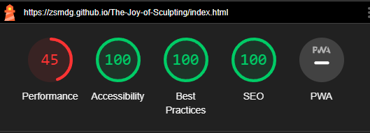

# The Joy of Sculpting

The joy of sculpting is for people who have been thinking about starting to sculpt, but don't know where to start. The site provides information on some brands of polymer clay and their properties. Information on various tools, paints and materials that can be used in the hobby of sculpting. The site also hopes to motivate and inspire the user to start sculpting and not get bogged down in thinking, "I'm not good enough"

## Features

- __Navigation Bar__

- On the main page, the navigation bar provides links to the various sections of the page: materials, tools, motivation and a link to the contact form page.
- On the contact page and the thank-you page, a link is provided to return to the home page.

- __Introduction section__

- This section will give the user information about me, how I got started sculpting, and how inspiration can come from anywhere.

- __Clay, materials, and tools section__

- The clay section provides the user with information about various polymer clay brands and the properties they have. 
This section also provides tips on how to easily knead clay, as well as information about liquid clay.

- The tools section provides the user with information about various tools that are available for sculpting. 
- As well as information on tools from other hobbies that can be used for sculpting.

- Other materials section provides the user with information on materials that can be used to make an armature or skeleton for their sculpture. 
- It also provides information on different brands of paint that can be used to finish sculptures.

- __Motivation section__

- This section provides the user with motivation to start sculpting.
- It shows the progress I've made over the years and shows the user that everyone has to start somewhere.

- __Footer__

 - The footer provides links to various social media sites for The Joy of Sculpting. The links will open a new tab.

- __Back to top button__

- The main page has a "back to top button" that takes the user back to the top.
- This helps the user easily navigate the site without having to scroll manually all the way to the top.

- __Contact page__

- This page allows the user to ask me a question they might have about sculpting.

- __Thank you page__

- provides the user with a message that informs them that their question has been received.

## testing

Below is a table of the various links and their expected behaviour and if they execute that behaviour.

| Section                 | Behaviour                  | Fail | Pass |
|-------------------------|----------------------------|------|------|
| nav materials           | Go to materials section    |      | X    |
| nav tools               | Go to tools section        |      | X    |
| nav motivation          | Go to motivation section   |      | X    |
| nav contact             | Go to the contact page     |      | X    |
| contact page nav home   | Go to main page            |      | X    |
| thank you page nav home | Go to main page            |      | X    |
| footer facebook icon    | open facebook in new tab   |      | X    |
| footer X(twitter) icon  | open X(twitter) in new tab |      | X    |
| footer instagram icon   | open instagram in new tab  |      | X    |
| footer youtube icon     | open youtube in new tab    |      | X    |

Each entry on the contact page is required and was tested by attempting to submit the form without entering anything in each field, or in the case of the email field, an entry with an "@" is required. The send button should take the user to the “Thank You” page after all fields have valid information in them, and it does. Responsiveness was tested in dev tools and on various devices and screen sizes mobile, desktop, TV.

The site was also tested with Lighthouse to ensure accessibility

- __Bugs__

 - Nothing I encountered can be considered bugs

### Validator Testing

- HTML
 - No errors were returned when passing through the official W3C HTML validator
- CSS
 - No errors were found when passing through the official W3C CSS validator

## Deployment

The site was deployed to GitHub pages. The steps to deploy are as follows:
In the GitHub repository, navigate to the Settings tab
From the source section drop-down menu, select the Master Branch
Once the master branch has been selected, the page will be automatically refreshed with a detailed ribbon display to indicate the successful deployment.

The live link can be found here - https://zsmdg.github.io/The-Joy-of-Sculpting/